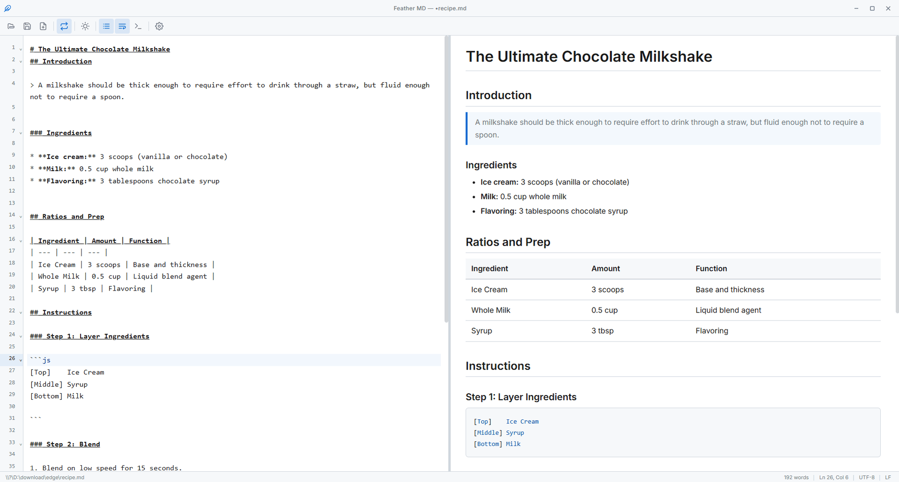

<!--
  Image placeholders used in this README.
  Drop the file in artifacts/screenshots/ and it will render automatically.

    1. artifacts/screenshots/demo.gif   Hero demo. 8-12s loop. Type Markdown, preview updates, switch theme, scroll sync. ~1400px wide, < 5 MB.

  Logo lives at artifacts/assets/feather-logo.png (already in repo).
  Additional screenshots are covered on the project landing page (link to be added).
-->

<div align="center">


# Feather MD

### A native, dual-pane Markdown editor that opens instantly and stays out of your way.

[](https://github.com/prathamreet/featherMD/actions/workflows/ci.yml)
[](https://github.com/prathamreet/featherMD/releases/latest)
[](https://github.com/prathamreet/featherMD/releases)
[](https://github.com/prathamreet/featherMD/stargazers)
[](LICENSE)
[](https://tauri.app)
[](https://codemirror.net)

**[Download](https://github.com/prathamreet/featherMD/releases/latest)** · **[What's new](https://github.com/prathamreet/featherMD/releases)** · **[Report a bug](https://github.com/prathamreet/featherMD/issues/new?template=bug_report.md)** · **[Request a feature](https://github.com/prathamreet/featherMD/issues/new?template=feature_request.md)**

<br />



</div>

---

## The pitch in one line

A 5 MB Windows installer, around 50 MB of RAM, sub-100 ms cold start, and a dual-pane preview that just works. Built on Tauri 2, not Electron.

## Why Feather MD

You probably already have a Markdown workflow, and it probably costs you 300 MB of RAM to read a `README`.

* You opened VS Code with its 200+ MB footprint just to skim a `.md` file.
* You fought the split preview that opens in the wrong place, with scroll sync that takes a documentation deep-dive to enable.
* You bounced between fifteen browser tabs trying to find the document you started 20 minutes ago.
* You wanted a single, focused window for writing. A text surface that opens before you finish reaching for the mouse.

Feather MD is the small, fast thing that lives between those edges.

* **Double-click a `.md` file and it opens.** Real OS file association. No "open in VS Code" workaround.
* **Side-by-side preview with bidirectional scroll sync, out of the box.** Toggle it off with `Alt + S` if you want.
* **A dedicated window, not another browser tab.** No distraction, no lost cursor.
* **5 MB Windows installer, around 50 MB resident.** Editing text should not cost a gigabyte of memory.
* **Tauri, not Electron.** Uses your OS WebView, ships no browser runtime, signs every update with Ed25519.
* **No telemetry, no background services, no accounts.** It is a text editor.

## Install

### Download a release

[Latest release (v1.4.1)](https://github.com/prathamreet/featherMD/releases/latest):

| Platform | File | Size |
| --- | --- | --- |
| Windows 10 / 11 | `Feather.MD_1.4.1_x64-setup.exe` (NSIS) | 5.0 MB |
| Debian / Ubuntu | `Feather.MD_1.4.1_amd64.deb` | 7.8 MB |
| Any Linux distro | `Feather.MD_1.4.1_amd64.AppImage` | 81.4 MB |

> The AppImage bundles its own GTK and WebKit runtime so it works on any Linux distro without system packages. The `.deb` uses your system libraries and stays small.

> Already on v1.2.7 or older? Auto-update was added in v1.3.0. Install the latest release once, manually, and the in-app updater takes over from there.

### Build from source

Requirements: Node.js 18+, Rust stable, and the platform's WebView toolchain. On Windows 10 and 11 WebView2 is pre-installed. On Linux you need the GTK / WebKit dev packages listed below.

```bash
git clone https://github.com/prathamreet/featherMD.git
cd featherMD
npm install
npm run tauri dev         # run in development with hot reload
npm run tauri build       # produce a signed release bundle
```

<details>
<summary>Linux system dependencies</summary>

```
libwebkit2gtk-4.1-dev
build-essential
curl
wget
file
libssl-dev
libgtk-3-dev
libayatana-appindicator3-dev
librsvg2-dev
```

</details>

Release bundles land in:

* Windows: `src-tauri/target/release/bundle/nsis/`
* Linux: `src-tauri/target/release/bundle/deb/` and `bundle/appimage/`

## Features

| | |
| --- | --- |
| **Premium Unified Header** | Combines legacy title-bar and toolbar into a singular, 40px bar. Mathematically centered active document title horizontally with transparent pointer events. |
| **Hover Dropdown Menus** | Mouse hover-activated dropdown menus (File, View, Style) with a 180ms hover-intent delay and diagonal pointer bridge to prevent accidental dismissals. |
| **Native dual-pane** | Editor on the left, live preview on the right. Resizable from 20% to 80%. Double-click the divider to reset to center. |
| **Bidirectional scroll sync** | Scroll either pane, the other follows. Ratio-based, no jitter on long documents. Toggleable. |
| **CodeMirror 6 editor** | Markdown syntax styling, code folding, bracket and quote auto-pair, active-line highlight, find and replace. |
| **Highlight.js code blocks** | On-demand language loading for fenced blocks. Hundreds of languages, no startup penalty. |
| **10 built-in themes** | Five light, five dark. Switches in under 1 ms. CSS variables locked to `:root` to preserve text contrast, zero relayout. |
| **Advanced Printing Engine** | Bypasses browser native headers/footers (hostnames, local times, page URLs) and viewport-clipping limits to support infinite multi-page document prints. |
| **External-change watcher** | If another program edits your open file, Feather MD reloads it. Asks first if you have unsaved edits. |
| **Recent files** | Up to ten, one click to re-open from the File -> Recent Files dropdown submenu, updating instantly on new saves. |
| **CLI launch** | `feathermd <path>` opens a file directly. Useful from a terminal or a shell hotkey. |
| **OS file associations** | `.md` and `.markdown` open in Feather MD on double-click. |
| **Signed auto-updates** | Cryptographically secure (Ed25519-signed) auto-update checking on startup with a minimalist slide-in notification banner and one-click installation. |
| **Persistent preferences** | Restores customizations natively on startup (theme, font family, font size, tab size, line numbers, word wrapping, scroll-sync, split ratio, window size, and windowMaximized state). |

## Performance budget

Real numbers from `npm run report` on the current build. Targets are PRD constraints the project ships against and CI enforces.

| Metric | Result | Target |
| --- | --- | --- |
| Installer size (Windows NSIS) | 5.03 MB | < 10 MB |
| Cold start | < 100 ms | < 100 ms |
| Idle RAM | ~30 MB | < 30 MB |
| Active RAM (10k-word doc) | ~50 MB | < 60 MB |
| Keystroke render latency | ~1 ms | < 200 ms |
| Theme swap | < 0.1 ms | < 16 ms |
| Background timers at idle | 0 | 0 |
| CSS bundle (gzip) | 19 KB | < 30 KB |
| Test suite | 204 / 204 passing | 100% |

## How it compares

| | Feather MD | VS Code | Typora | Obsidian |
| --- | --- | --- | --- | --- |
| Installer size | **~5 MB** | ~90 MB | ~85 MB | ~110 MB |
| Active RAM | **~50 MB** | ~300 MB | ~150 MB | ~400 MB |
| Cold start | **< 100 ms** | 1 to 3 s | < 1 s | 1 to 2 s |
| Dual-pane preview | Built in | Extension / split editor | Hybrid only | Plugin |
| Native binary | Yes (Tauri) | No (Electron) | No (Electron) | No (Electron) |
| Telemetry | None | Opt-out | Opt-out | Opt-in |
| Cost | Free, MIT | Free, MIT | Paid | Free, freemium |

Numbers are approximate from public reporting and our own measurements. Different scenarios, different tools. Feather MD is the right pick when you want a fast, focused Markdown surface, not a full IDE or a note vault.

## Who this is for

* You read and edit `.md` files all day and you want the double-click experience to be instant.
* You write blog posts, docs, RFCs, or PRDs in plain Markdown and you want a live preview without opening an IDE.
* You like keyboard-first tools and would rather not deal with bloated UIs.
* You care about what your machine is running. You looked at Task Manager today.
* You want a tool that does one thing well and gets out of the way.

If you are managing thousands of linked notes with backlinks and graphs, you want Obsidian, not this. If you are writing code with Markdown on the side, you already have VS Code. Feather MD is the third option for everything else.

## Keyboard shortcuts

| Key | Action |
| --- | --- |
| `Ctrl + N` | New file |
| `Ctrl + O` | Open file |
| `Ctrl + S` | Save |
| `Ctrl + Shift + S` | Save as |
| `Ctrl + P` | Print document |
| `Ctrl + F` | Find |
| `Ctrl + H` | Find and replace |
| `Ctrl + L` | Toggle line numbers |
| `Alt + Z` | Toggle word wrap |
| `Alt + S` | Toggle scroll sync |
| `Ctrl + ?` | Show all shortcuts |

## Architecture

Feather MD is a strictly modular Vite + Tauri app. Each module has one responsibility and no surprise dependencies.

```
featherMD/
├── index.html                       Single HTML entry, custom title bar, settings + dialogs DOM
├── package.json                     Frontend dependencies and npm scripts
├── vite.config.js                   Vite build config (Tauri-aware targets, asset prefixes)
├── vitest.config.js                 Test runner config (jsdom environment)
├── eslint.config.js                 Flat ESLint config with browser + node globals
│
├── src/                             Frontend source. All ESM, no transpilation needed.
│   ├── main.js                      App orchestrator. Wires modules together in DOMContentLoaded.
│   │
│   ├── editor/
│   │   └── editor.js                CodeMirror 6 setup. Compartments for line-numbers, wrap,
│   │                                and tab-size preference.
│   │
│   ├── preview/
│   │   └── preview.js               Marked + DOMPurify pipeline. highlight.js loaded on-demand
│   │                                per language via import.meta.glob.
│   │
│   ├── ui/
│   │   ├── toolbar.js               Unified header bar menu dropdowns, font size control, and recent files builder.
│   │   ├── settings.js              Helper to update the recent files list in the dropdown submenu.
│   │   ├── themes.js                Theme switching + prefers-color-scheme detection.
│   │   ├── dialogs.js               Unsaved-changes prompt and shortcuts help modal.
│   │   ├── status-bar.js            Word count, cursor position, file path, line ending.
│   │   └── divider.js               Editor/preview split-pane drag handle.
│   │
│   ├── core/
│   │   ├── config.js                Defaults + Tauri appConfigDir / localStorage persistence.
│   │   ├── state.js                 HMR-resistant window state (file path, dirty, line ending).
│   │   ├── file-io.js               open / save / save-as / new + recent files + unsaved guard.
│   │   ├── keyboard.js              Global keyboard shortcut bindings.
│   │   ├── sync.js                  Bidirectional ratio-based scroll sync.
│   │   ├── welcome.js               Default welcome document.
│   │   └── utils.js                 Shared helpers (escapeHtml).
│   │
│   ├── platform/
│   │   ├── window.js                Tauri window controls (minimize, maximize, close) + size persistence.
│   │   └── updater.js               Ed25519-verified auto-update check on startup.
│   │
│   └── styles/
│       ├── base.css                 Layout, title bar, settings panel, modal overlays.
│       ├── editor.css               CodeMirror customizations.
│       ├── preview.css              Markdown preview typography and code-block styling.
│       ├── toolbar.css              Toolbar and status bar.
│       └── themes/                  10 themes: snow, solarized-light, github-light, sepia,
│                                    gruvbox-light, onyx, solarized-dark, github-dark,
│                                    monokai, gruvbox-dark.
│
├── src-tauri/                       Rust backend.
│   ├── src/
│   │   ├── main.rs                  Tauri app entry.
│   │   └── lib.rs                   IPC commands: watch_file, unwatch_file, get_initial_file.
│   │                                Spawns an async tokio file watcher for external-change events.
│   ├── capabilities/
│   │   └── default.json             Tauri 2 permission scopes for plugins.
│   ├── icons/                       Platform icons (Windows .ico, Linux .png, mobile sets).
│   ├── tauri.conf.json              Window config, bundle targets, updater endpoint + pubkey.
│   ├── Cargo.toml                   Rust dependencies.
│   └── build.rs                     Tauri build script.
│
├── tests/                           Vitest suites mirroring src/ layout. 204 specs across 8 files.
│   ├── editor/editor.test.js        CodeMirror integration: API surface, compartments, cursor.
│   ├── preview/preview.test.js      Markdown rendering, XSS sanitization, GFM, scroll API.
│   ├── ui/
│   │   ├── toolbar.test.js          Button bindings, dropdown behavior, active state.
│   │   ├── settings.test.js         Settings panel controls + recent-files rendering.
│   │   └── themes.test.js           Theme switching, OS detection, all 10 themes.
│   ├── core/sync.test.js            Bidirectional scroll sync + feedback-loop prevention.
│   ├── html.test.js                 index.html structure, ARIA, keyboard accessibility.
│   ├── security.test.js             SEC-01/02/03 + CODE-01 + PERF-01 regression guards.
│   └── performance.bench.js         Render latency, word count, theme swap benchmarks.
│
├── scripts/
│   ├── generate-report.js           Full audit: build + lint + tests + bench + bundle sizes.
│   └── version-bump.js              Sync version across package.json / Cargo.toml / tauri.conf.
│
├── .github/                         Issue templates, PR template, CI + release workflows.
└── artifacts/                       Logo, screenshots, PRD spec.
```

| Layer | Choice | Why |
| --- | --- | --- |
| Shell | Tauri 2 (Rust) | Uses the OS WebView. Ships no browser. |
| Web runtime | WebView2 / WebKitGTK | Already on the user's machine. |
| Editor | CodeMirror 6 | Tree-shaken to about 300 KB. |
| Markdown | Marked + DOMPurify | Synchronous, sanitized. |
| Code highlight | highlight.js | Lazy-loaded per language. |
| Bundler | Vite 6 | Main bundle plus on-demand chunks. |
| Updater | Tauri updater + process plugins | Ed25519-signed, in-place relaunch. |

## Quality checks

```bash
npm test            # 204 specs across 8 suites
npm run lint        # ESLint
npm run bench       # Render latency, word count, theme swap benchmarks
npm run report      # Full audit: build + tests + bench + bundle sizes
```

CI runs the full audit on every push and every pull request.

## FAQ

**Is there a macOS build?**
Not yet. The codebase is Tauri so a macOS build is a CI job away. It is on the roadmap. If you want to help land it sooner, see the open issue.

**Can I edit files larger than X MB?**
Yes. CodeMirror 6 handles large files efficiently. There is no hard cap. Performance degrades smoothly on truly huge files (50 MB+) the same way any text editor does.

**Does it support tables, footnotes, task lists, math?**
Tables, task lists, fenced code, GFM extensions: yes. Footnotes and math (KaTeX / MathJax) are not enabled by default to keep the bundle small. A toggle is on the roadmap.

**Where are my settings stored?**
On Tauri builds, the OS config directory under `feathermd/config.json`. On Windows that is `%APPDATA%\com.feathermd.app\feathermd\config.json`. On Linux, `~/.config/com.feathermd.app/feathermd/config.json`. A `localStorage` fallback is used in browser dev mode.

**Is the auto-updater safe?**
Releases are signed with Ed25519. The public key is embedded in the binary. The updater verifies the signature before writing anything. See [SECURITY.md](SECURITY.md).

**How does the advanced printing engine work?**
Pressing `Ctrl + P` (or selecting File -> Print) bypasses native browser headers and footers (local times, hostnames, page URLs) using page margin overrides. It also resolves viewport clipping issues, allowing you to print clean, infinite multi-page documents seamlessly.

**Why is there no plugin system?**
A plugin system is a commitment to an API surface for a long time. Feather MD is small enough that a focused feature set is the point. If something is missing, open an issue. Frequent requests turn into core features.

## Roadmap

A short list of what is planned. Not a promise. PRs welcome.

* [ ] macOS bundle (Universal binary)
* [ ] Document outline in the gutter
* [ ] Export to HTML and PDF
* [ ] Optional offline spellcheck (OS-native)
* [ ] Snippets and template library
* [ ] First-class image paste with sidecar storage
* [ ] Footnotes and math rendering toggles
* [ ] More themes (community-contributed)

## Contributing

Bug reports, feature requests, themes, documentation, and code PRs are all welcome.

* Workflow and standards: [CONTRIBUTING.md](CONTRIBUTING.md)
* Community norms: [CODE_OF_CONDUCT.md](CODE_OF_CONDUCT.md)
* Security disclosures: [SECURITY.md](SECURITY.md)

First-time open-source contributor? Open a small documentation fix to get familiar with the flow.

## Acknowledgments

Feather MD stands on the work of others. Thanks to:

* [Tauri](https://tauri.app) for proving you do not need to ship Chromium.
* [CodeMirror 6](https://codemirror.net) for an editor that respects the bundle budget.
* [Marked](https://marked.js.org) and [DOMPurify](https://github.com/cure53/DOMPurify) for fast, safe Markdown.
* [highlight.js](https://highlightjs.org) for syntax highlighting that lazy-loads cleanly.
* [Vite](https://vitejs.dev) for a build chain that gets out of the way.

## Star history

If Feather MD saved you a few hundred MB of RAM today, a star helps it reach the next person tired of Electron.

[](https://star-history.com/#prathamreet/featherMD&Date)

## License

[MIT](LICENSE). Use it, fork it, ship it.

