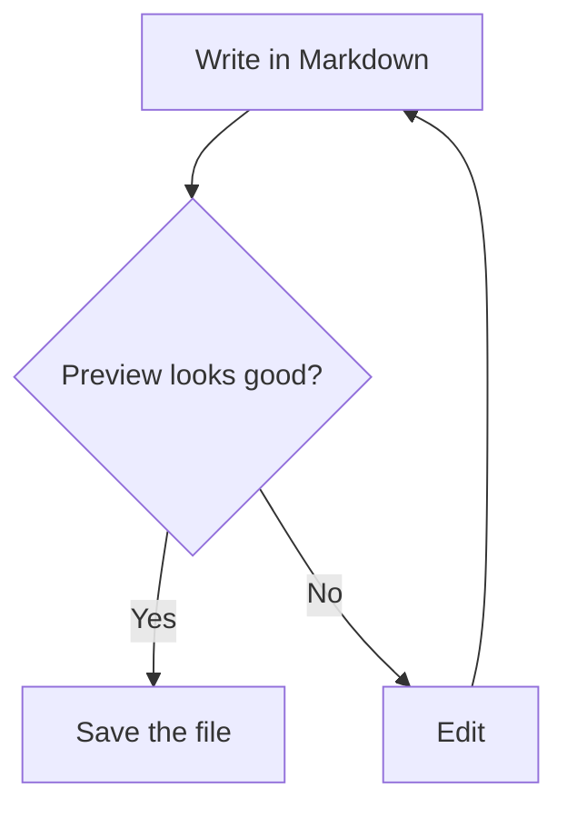
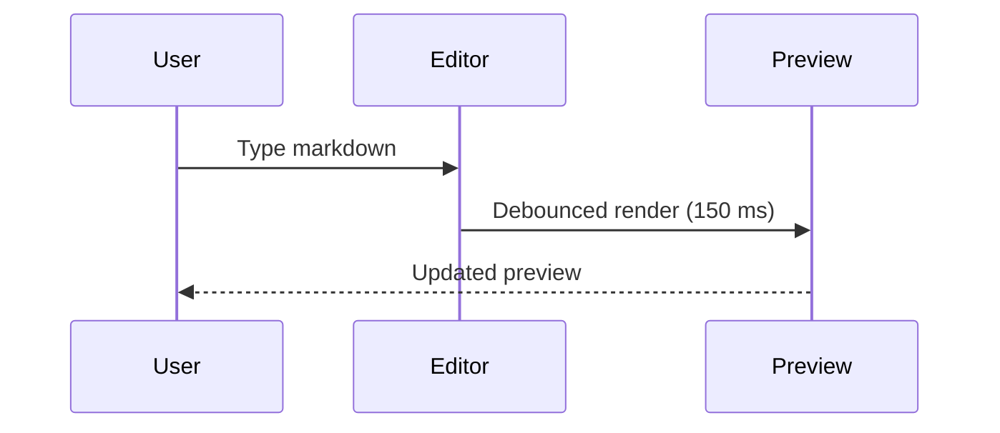
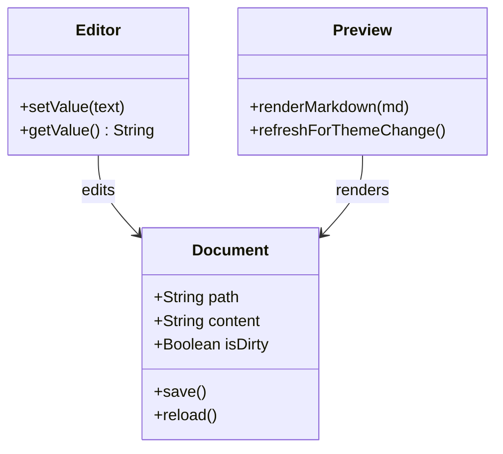
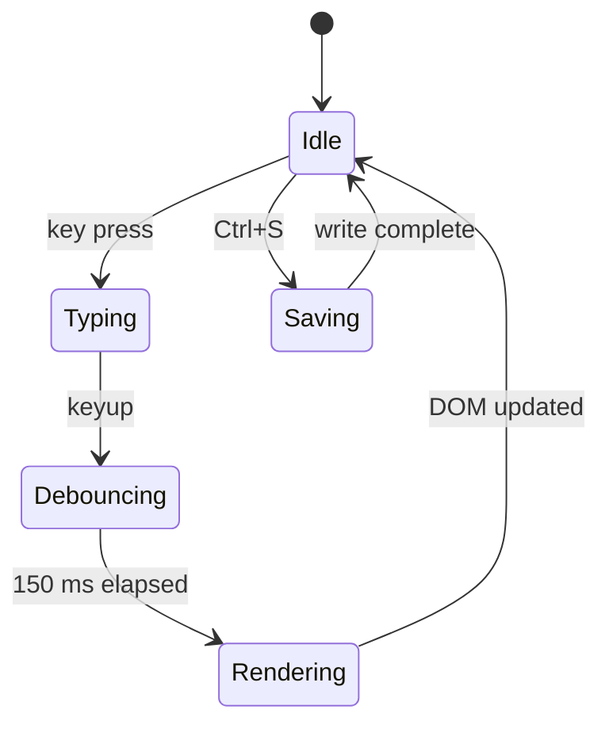
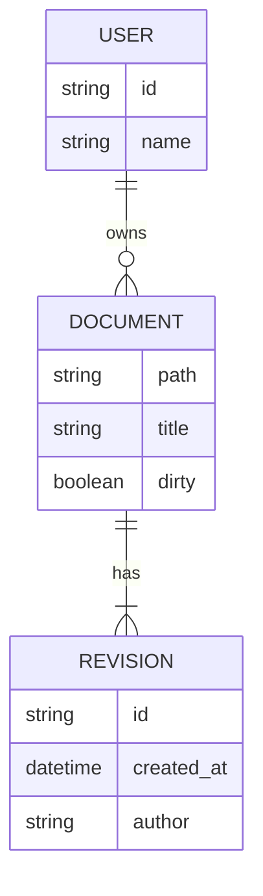
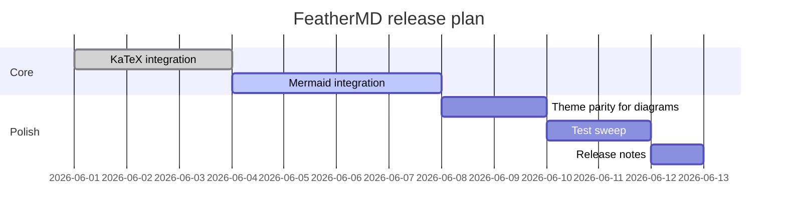
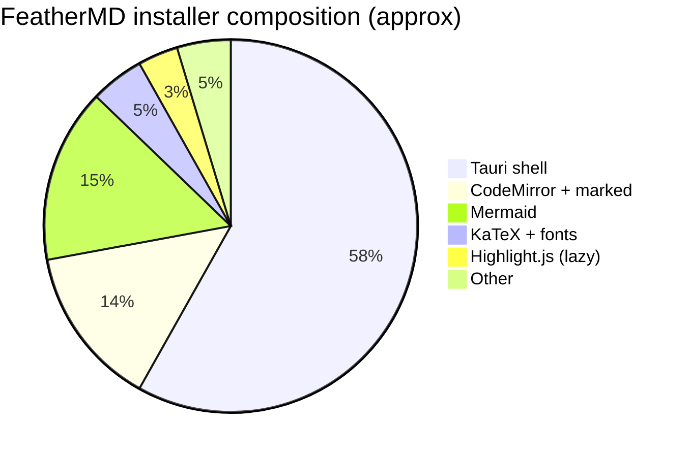
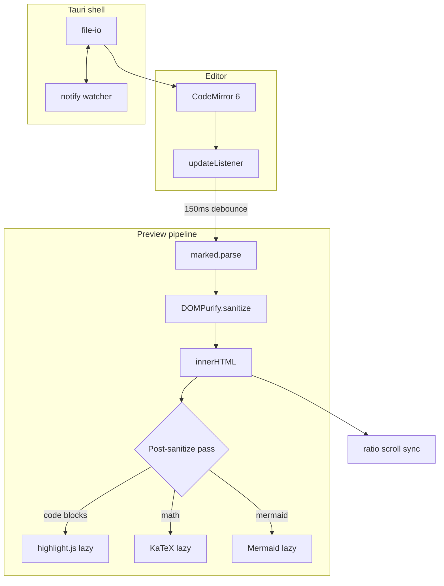
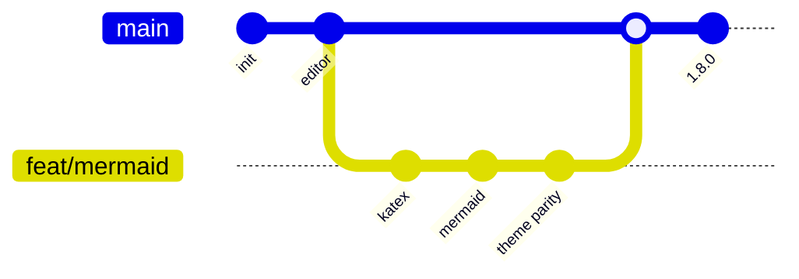

# Feather MD — Math + Diagrams Test Sheet

### 1.1 Maxwell's equations (display, aligned)

$$
\begin{aligned}
\nabla \cdot \mathbf{E} &= \frac{\rho}{\varepsilon_0} \\
\nabla \cdot \mathbf{B} &= 0 \\
\nabla \times \mathbf{E} &= -\frac{\partial \mathbf{B}}{\partial t} \\
\nabla \times \mathbf{B} &= \mu_0 \mathbf{J} + \mu_0 \varepsilon_0 \frac{\partial \mathbf{E}}{\partial t}
\end{aligned}
$$

### 1.2 Schrödinger equation (time-dependent)

$$
i\hbar \frac{\partial}{\partial t} \Psi(\mathbf{r}, t) = \left[ -\frac{\hbar^2}{2m} \nabla^2 + V(\mathbf{r}, t) \right] \Psi(\mathbf{r}, t)
$$

### 1.3 Cauchy's residue theorem

$$
\oint_{\gamma} f(z)\, dz = 2\pi i \sum_{k=1}^{n} \operatorname{Res}(f, a_k)
$$

### 1.4 Fourier transform pair

$$
\hat{f}(\xi) = \int_{-\infty}^{\infty} f(x)\, e^{-2\pi i x \xi}\, dx
\qquad
f(x) = \int_{-\infty}^{\infty} \hat{f}(\xi)\, e^{2\pi i x \xi}\, d\xi
$$

### 1.5 Matrix and determinant

$$
A = \begin{pmatrix} a & b \\ c & d \end{pmatrix}, \qquad \det(A) = ad - bc
$$

### 1.6 Beta function

$$
B(x, y) = \int_0^1 t^{x-1}(1-t)^{y-1}\, dt
$$

### 1.7 Binomial coefficient with summation

$$
\sum_{k=0}^{n} \binom{n}{k} x^{k} = (1 + x)^n
$$

### 1.8 Quadratic formula

$$
x = \frac{-b \pm \sqrt{b^2 - 4ac}}{2a}
$$

### 1.9 Limit definition of $e$

$$
e = \lim_{n \to \infty} \left(1 + \frac{1}{n}\right)^n
$$

### 1.10 Inline math, scattered through prose

Einstein's mass–energy equivalence is $E = mc^2$, the Pythagorean identity is $a^2 + b^2 = c^2$, Euler's identity is $e^{i\pi} + 1 = 0$, and the golden ratio satisfies $\varphi = \tfrac{1 + \sqrt{5}}{2}$. A simple fraction like $\tfrac{1}{2}$ should sit inline cleanly.

### 1.11 Sub/superscripts

$$
x_1^2 + x_2^2 + \cdots + x_n^2 = \sum_{i=1}^{n} x_i^2
$$

### 1.12 Greek letters and operators (smoke test)

$\alpha, \beta, \gamma, \delta, \epsilon, \zeta, \eta, \theta, \lambda, \mu, \pi, \sigma, \phi, \omega$ — and $\le, \ge, \neq, \approx, \in, \notin, \subset, \cup, \cap, \to, \Rightarrow, \forall, \exists$.

---
### 2.1 Two-node flowchart

### 2.2 Decision flowchart

### 2.3 Sequence diagram

### 2.4 Class diagram

### 2.5 State diagram

### 2.6 ER diagram

### 2.7 Gantt chart

### 2.8 Pie chart

### 2.9 Complex multi-subgraph flowchart

### 2.10 Git graph

